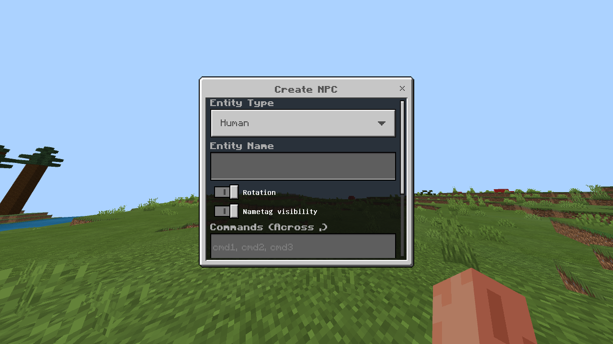

##NPC - Plugin for simplified NPC creation (NUKKIT API 1.0.9)

>- ###This plugin requires [FormAPI](https://nukkitx.com/resources/formapi.359/) installed!

 ####Permission: ***npc.use***
 ####Available commands:
 #####/npc spawn - Create npc entity 
 #####/npc getID - Get ID entity 
 #####/npc list - Get npc entity list 
 #####/npc teleport - Teleport entity to you
 #####/npc edit - Open entity setup menu 
 
 